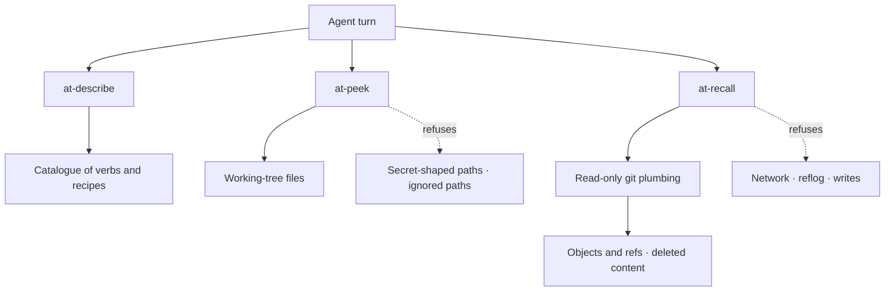

# Read-only inspection tools for agents

**Status:** proposal, 2026-09-22; part built. Built and tested: `tools/at-core` (the shared output
contract and path containment), `tools/at-peek` (`stat`, `slice`, `search`), `tools/at-recall`
(`state`, `diff`), and `tools/at-describe` (the catalogue). The toolkit is packaged by this
repository's `flake.nix` and wired into the org's shells by `defrag-nix`. Everything else here is
still the plan: the remaining verbs (`tree`, `find`, `outline`, `scope` in `peek`; `log`, `show`,
`blame`, `why`, `churn`, `search` in `recall`), the recipes, and the rule and skill drafts at the
end — which stay drafts until the verbs they name exist.

Three things the implementation settled that this document did not anticipate, each of them a test
rather than a paragraph (`tools/at-recall/tests/contract.rs`):

- **A worktree diff can run a program the repository names.** `git diff` invokes
  `filter.<driver>.clean`, selected by `.gitattributes`, to convert a working-tree file into the
  blob it would commit. `at-recall` therefore gathers its change set from the two reads that convert
  nothing — the index against the revision, and the status against the index — and refuses by name
  rather than running it, or printing raw bytes where the filtered form was expected.
- **`git diff` with no revision compares the index with the worktree**, which is not the answer to
  "what have I changed". `at-recall diff` names `HEAD` explicitly rather than inheriting that
  default, and the header says which comparison it made.
- **`--no-optional-locks` is load-bearing**, not tidiness: without it a read refreshes the index, so
  `no_command_writes` snapshots `.git` as well as the tree.

Output in the sections below is illustrative. The *shapes* are the contract; the values are not.
In prose, `at-peek` and `at-recall` shorten to `peek` and `recall`; in a command they never do.

## The problem

An agent working out what is going on reaches for a shell tool, and every reach is a decision I
have to make. Three costs, and the third is the one that gets missed:

- **Approvals.** `git log`, `git status`, `git diff`, `git blame`, `sed -n`, `rg | head`,
  `ls -R | head`. Git *is* the problem case — the rest of the tree I have largely delegated to
  the editor tools, but history has no read-only path that is not `git` itself.
- **Legibility.** `git log --format='%h %ad %an %s' --date=short | head -20` is a program. To
  approve it I reconstruct its intent from its syntax, every time. Two commands where one would
  do is two reconstructions.
- **Honest bounds.** `| head -20` is not a bound the agent understands. It cannot tell a file
  with 20 matches from a file with 2,000, and nothing in the transcript says which it saw — so
  it reports "the only callers are…" from a truncated list. The sandbox makes this worse: a
  command containing `$(…)`, a loop, or `<(…)` is refused outright, so agents route around the
  refusal with worse compositions.

`rules/core/verify-before-claiming` tells an agent to claim only what it saw. A `| head`
pipeline makes *seeing* unknowable. These tools exist so that the bound is stated in the output
rather than hidden in a pipe.

## The shape

One namespace (`at-` for agent tools), three binaries, because they are three trust tiers and an
approval should grant the smallest one that answers the question.

| | `at-describe` | `at-peek` | `at-recall` |
| --- | --- | --- | --- |
| Reads | Nothing | Working-tree files | `.git` objects and refs |
| Replaces | — | `cat`, `sed -n`, `rg`, `find`, `ls -R` | `git log`, `status`, `diff`, `show`, `blame` |
| New capability vs what I already approve | None — no arguments, opens nothing | **None** — a strict subset of `cat` | History, other branches, deleted content |
| Subprocess | None | None | One, `git`, plumbing verbs only |
| Network | Never | Never | Never |
| Writes | Never | Never | Never |
| Grant | Always allow | Blanket allow | Per-verb judgement; one verb is opt-in per invocation |

The namespace is a promise rather than a filing convention: **membership in `at-` claims that the
binary's entire grammar is safe to allowlist.** No member has a write path in any form — not a
flag, not a cache file, not an option to be added later. Without that, someone eventually adds
`at-edit`, and it inherits the trust the prefix earned while being the exact thing the prefix was
supposed to guarantee.



`at-describe` is why the other two can stay terse: it is the toolkit's own catalogue, bounded to a
screen, and it spans both binaries — "to answer *why*, use `at-recall why`, then `at-peek slice`
around it" is a sentence no individual tool's `--help` can say. Per-verb flags stay in `--help`;
`at-describe` answers "what can I ask".

The line between the other two is not "code versus git" — it is **content that exists versus
content that no longer does**. `at-recall` can read a secret that was committed and then removed,
which is the one thing on this list that a `cat` approval never granted. That is why it is a
separate binary rather than a verb on `peek`.

## Before and after

Every verb earns its place by replacing a command I currently approve, or by answering a
question I currently watch an agent assemble a pipeline to answer.

| The question | Today | With the tools |
| --- | --- | --- |
| What is in here? | `ls -R \| head -40` | `at-peek tree src --depth 2` |
| Where is it defined? | `rg -n 'fn render_claim' --type rust \| head -5` | `at-peek outline src/lib.rs` · `at-peek search '\bfn render_claim\b'` |
| Read lines 40–60 | `sed -n '40,60p' src/lib.rs` | `at-peek slice src/lib.rs:40-60` |
| Which function is line 120 in? | `rg -n '^\s*fn ' src/lib.rs \| head -30` + arithmetic | `at-peek scope src/lib.rs:120` |
| Everything mentioning this | `rg -n sym \| head -40` | `at-peek search sym` |
| How many matches | `rg -c sym` | `at-peek search sym --count` |
| What am I looking at? | `git status --short` *and* `git rev-parse --abbrev-ref HEAD` | `at-recall state` |
| What changed lately? | `git log --oneline -20` | `at-recall log --limit 20` |
| What have I changed? | `git diff --stat` | `at-recall diff @` |
| Who last touched these lines? | `git blame -L 40,60 f.rs` | `at-recall blame f.rs:40-60` |
| **Why** are these lines like this? | blame, then copy the hash, then `git show <hash>` | `at-recall why f.rs:40-60` |
| When did this string appear? | `git log -S"foo" --oneline \| head` | `at-recall search foo --content` |
| Is this file stable or hot? | `git log --format=%an -- f \| sort \| uniq -c \| sort -rn` | `at-recall churn f.rs` |
| Write the PR description | `status`, `merge-base`, `log --oneline base..HEAD`, `diff --stat`, then reads | `at-recall pr` |

The last four rows are the point. `git blame` gives a hash; the answer to "why" is in the commit
message, which blame does not print and which the agent then has to ask for separately. Four
approvals and two round trips for one question an agent asks constantly.

### The objection this has to survive

In Zed the agent already has `read_file` (with outline), `grep` and `find_path`. Why a CLI?

`recall` is the load-bearing half and the objection does not apply to it at all — there is no
editor tool for history. For `peek`, honestly: three of its verbs overlap with tools the agent
already has, and the marginal value is smaller than the table above implies. It earns its place
on four narrower grounds:

- **Bounds are ours.** `peek` decides what "20 results" means, states it, and clamps it. The
  native tools' bounds are not inspectable from a transcript.
- **Transfer.** A rule that says "use `at-peek scope`" is true in Claude Code, in Codex, in a plain
  shell over ssh, and in a script. A rule that says "use the `read_file` tool" is true in one
  harness.
- **Ranges.** `read_file` returns a file or an outline. Nothing returns *lines 40–60*, and nothing
  returns the enclosing declaration of a line you already have a number for.
- **Reviewability.** A whitelisted verb is a sentence in the transcript. An editor tool call is
  not something I approve or decline at all — which is fine, but it means the CLI is the only
  form in which I can see, and later audit, how an agent worked out what it worked out.

If only one of the two gets built, build `recall` — it carries the history grant, and every recipe
in the next section.

## `at-peek` — the working tree

Target syntax is `path`, `path:LINE`, `path:START-END` (1-based, inclusive), `path:START+N`
(from START, N lines), `path@SYMBOL`. Multiple targets per invocation, so a loop is never
needed — which matters, because the sandbox refuses one.

| Verb | Answers | Notes |
| --- | --- | --- |
| `at-peek tree [dir] [--depth N]` | What is in here | Gitignore-aware; reports counts for excluded paths |
| `at-peek find <glob>` | Where is that file | Sorted; same ignore rules as `tree` |
| `at-peek stat <path…>` | How big is it, when did it change | Lines, bytes, language — the file you just wrote |
| `at-peek outline <path…>` | What does this file declare | Symbols with line ranges, grouped by kind |
| `at-peek scope <path>:<line>` | What declaration is this line inside | The whole body, plus `--context N` outside it |
| `at-peek slice <path>:<range>…` | These exact lines | Always line-numbered; `@symbol` for a whole declaration |
| `at-peek search <pattern> [path…]` | Every mention | Regex; `--context N`; `--count`; `--files-only`; bottom line carries the true total |

`--count` and `stat` are the two aggregate shapes: "how many, not which" and "did the write land".
Neither is answerable from a listing, and reaching for `grep -c` instead returns no bound and no
provenance. Verbs whose answer is several sections rather than one are in *Recipes* below.

```
$ at-peek slice crates/archivist/src/cache.rs:41-44
# at-peek slice · archivist · crates/archivist/src/cache.rs:41-44
41  let store = CacheStore::open(&path)?;
42  drop(store);
43  // released before the writer thread joins
44  writer.join()?;
# 4 lines of 412 · at-peek slice crates/archivist/src/cache.rs:1-412 for the rest
```

Three lines of the contract are already visible in that example: a header naming what was read,
line numbers on every line, and a trailer stating what was *not* shown and how to widen.

## `at-recall` — history

Two of the verbs below are built — `state` and `diff` — and the rest are the design. Built means
their shapes are asserted from outside the binary; the table is the specification for what is not.

Revisions accept `@` (HEAD), `@~N`, `@^`, a short hash, a branch or tag name, and `A..B`.
Anything beginning with `-` is rejected as a rev, so a revision can never be read as a flag, and
`@{…}` is refused by name whether or not it resolves: the reflog is not read.

| Verb | Answers | Default shape |
| --- | --- | --- |
| `at-recall state [path] [--wide]` | What am I looking at | Branch + upstream divergence, HEAD, in-progress op, modified/untracked counts and names; `--wide` adds what the branch is ahead of its base |
| `at-recall log [path]` | What changed lately | One line per commit; `--since`, `--author`, `--message`, `--follow` |
| `at-recall show <rev>` | What did that commit do | Message, stat; `--patch` adds the diff |
| `at-recall diff <revA>[..<revB>] [path]` | What is the difference | **Stat by default**; `--patch` adds hunks. `@` means HEAD, so `at-recall diff @ f.rs` is "what have I changed" |
| `at-recall blame <path>:<range>` | Who last touched these lines | Grouped into ranges, each with rev, author, date, subject |
| `at-recall why <path>:<range>` | Why are these lines like this | Blame ranges plus the first paragraph of each commit's message |
| `at-recall churn <path\|dir>` | Is this stable or hot | Commits, authors, first/last touch; under a directory, the top-N most-changed files |
| `at-recall search <pattern>` | When did this appear or go | `--message` (default) searches commit messages; `--content` is the pickaxe |

`blame` grouped rather than per-line, because per-line output is the single largest thing an
agent asks for and the least of it is read:

```
$ at-recall blame crates/archivist/src/cache.rs:41-68
# at-recall blame · archivist · crates/archivist/src/cache.rs:41-68 · 2 ranges
41-66  3f2a1c9  2026-07-14  damo  Close the redb handle before the writer thread exits
67-68  b41d7e0  2026-08-02  ana   Tidy imports
```

`why` is the composite that saves the round trip:

```
$ at-recall why crates/archivist/src/cache.rs:41-66
# at-recall why · archivist · crates/archivist/src/cache.rs:41-66 · 1 commit
3f2a1c9  2026-07-14  damo  Close the redb handle before the writer thread exits
  The previous shape dropped the handle on the pool thread, so the next start saw a
  stale lock and reported "already open". See #118.
```

`churn` is the one verb with no git equivalent that anyone types, and it exists for a decision
rather than a lookup: "should I refactor this?" is answered by "this file has 340 commits and 12
authors in the last year", not by its contents.

Same honesty rule as `peek`, applied to work rather than output:

```
$ at-recall churn crates/archivist/src
# at-recall churn · archivist · crates/archivist/src · since 2026-03-22 (6 months)
# walked 500 of 12431 commits · --all to widen the window
crates/archivist/src/cache.rs                     143 commits   7 authors   last 2026-07-14
crates/archivist/src/koios.rs                      61 commits   4 authors   last 2026-08-30
```

## Recipes — questions that take five commands

Every verb above answers one question with one read. A recipe answers a question that recurringly
takes five reads and a paragraph of assembly. The motivating case: *"write me a PR description"*
starts an archaeology — branch name, `merge-base`, `log --oneline base..HEAD`, `diff --stat`, then
reads to work out what the diff means — and every step is a separate approval.

A recipe is not a new kind of thing. It is a verb whose answer is several sections instead of one,
subject to the same contract, with four rules on top:

1. **It prints facts, never conclusions.** `manifest changed: Cargo.toml (+1 dependency)` — not
   "this is a breaking change". Categories are objective; judgement belongs to the reader. The
   tool reports what it sees, the playbook encodes what that means. Folding a rule into the tool
   is the temptation to resist: it makes the tool org-specific and the rule invisible.
2. **Every section carries a bound and a caveat.** *Bounds* say how much was shown (`4 commits of
   50`); *caveats* say what would make the answer wrong (`base is the local origin/main ref and
   was not fetched — the remote may be ahead`). A recipe with bounds and no caveats is a summary
   that reads as a finding.
3. **Recipes are code, not configuration.** A user-editable recipe file would make `at-recall pr`
   mean "run whatever that file says", and the grant stops being total. The set is built in,
   named and fixed. Repo-specific procedure belongs in the playbook — a skill that sequences
   allowlisted verbs — not in the tool.
4. **One trust tier each.** A recipe that needs history lives in `at-recall`; one that needs only
   the working tree lives in `at-peek`. Nothing spans both, so nothing silently needs the higher
   grant.

The admission test for a new recipe — all four, or it is a flag: it answers a question that
recurs in a real session · no single verb with flags already answers it · every section is
derivable from the repository in front of it · it reads within one trust tier.

| Verb | Answers | Sections |
| --- | --- | --- |
| `at-peek overview` | What is this repository | Layout, languages by file count, manifests, docs, test layout, declared commands |
| `at-peek commands` | How do I build and test here | What the manifests declare — `flake.nix`, `Cargo.toml`, `package.json`, `Makefile` — never a claim about which is right |
| `at-recall pr` | Write the PR description | Base and its caveat, commits, diffstat by area, category flags |
| `at-recall review` | What should I scrutinise | The same facts, risk-ordered, with churn per file |
| `at-recall release [--since <tag>]` | What goes in the changelog | Commits since the last tag, grouped by the prefix convention their messages already use |

`at-describe` lists the recipes under the binary that owns them, so the rule does not have to.
`at-recall pr` in full — the shape the other two follow:

```
$ at-recall pr
# at-recall pr · archivist · base origin/main (merge-base 9c1f2ab)
# caveat: origin/main is the local ref and was not fetched — the remote may be ahead
commits     4
  3f2a1c9 2026-07-14 damo  Close the redb handle before the writer thread exits
  b41d7e0 2026-08-02 ana   Tidy cache module imports
  ...
diffstat    9 files, +412 −118 (1 binary skipped)
  crates/archivist/src/cache.rs  +180 −40
  Cargo.toml                     +2 −1    manifest
  crates/archivist/Cargo.lock    +31 −12  lockfile
areas       1 manifest · 1 lockfile · 0 schema · 0 generated
# 9 of 9 files · at-recall diff origin/main --patch for the hunks
```

### Candidates it rejects

The test has to reject things, or it is decoration:

| Candidate | Verdict |
| --- | --- |
| `at-peek outline --wide` | A flag, not a recipe — imports, counts by kind and test presence are one file's shape |
| `at-recall state --wide` | A flag. "Where was I" is dirty files plus what is ahead of the base |
| "Why is this crate pinned here?" | `at-recall why Cargo.toml:<line>` already answers it |
| "What tests cover this?" | `at-peek search` on the symbol, narrowed to test paths |
| "Which commit broke this?" | Out. Bisect builds and runs, so it is not read-only |

### The PR example, end to end

Three layers, and the recipe is only the first:

1. `at-recall pr` — the derivable half, with its bounds and caveats.
2. An `open-pr` skill — the procedure: read the diff for the narrative, map each change to the
   reason it exists, order the description.
3. `rules/org/defrag/commit-conventions` — already exists, and already says what a PR should
   contain: summary, linked issue, test coverage, screenshots, flags involved.

The tool supplies facts, the skill supplies order, the rule supplies the conventions. None of them
writes the description, because the reason a change exists is the one thing here that is not
derivable from the repository.

## The output contract

These are the invariants that make the tools cheap to read and safe to allowlist. They are the
spec, and each one is a test.

1. **Bounded, and the bound is stated.** Defaults around 200 lines / 50 search results / 20
   commits; a `--limit` above the ceiling is clamped and says so. Every output that was cut ends
   with a trailer naming the true total and the flag that widens it. Truncation is never silent
   and never an error.
2. **Deterministic.** Fixed sort orders, UTC ISO-8601 dates, no locale, no clock in the output,
   no `isatty` branch. Same input, same bytes — the same property
   `rendering_is_byte_stable` pins in this repository.
3. **Self-locating.** `path:line:` prefixes and a header naming the root, verb and target, so a
   transcript line can be cited and a reviewer can see exactly what was read. Multi-root
   workspaces are explicit: one root per invocation, resolved from the cwd, `--root <path>` to
   address another tree. The flag takes a *path*, not a name — naming a sibling would need a
   registry of workspace roots, and a registry is configuration, which a whitelist cannot see.
4. **Closed flag set.** An unknown flag is exit 2, never a warning. Nothing is forwarded to git,
   no `--` pass-through, no pattern that becomes an option. The complete grammar of what the
   tool can be asked to do is readable in `--help`.
5. **No environment configuration.** No `PEEK_*` / `RECALL_*` variables. An env var is a hidden
   argument, and a whitelist cannot see one.
6. **No colour in v1.** Removes the terminal-detection branch, and ANSI escapes are tokens spent
   on nothing when an agent is the reader.
7. **`--format text|json`.** Text is what an agent reads. JSON carries `schema_version` and
   mirrors the text, defined as ordinary structs — which is also what the tests assert against,
   so the human format can be tuned without breaking the spec.
8. **Exit codes.** `0` results, `1` nothing found, `2` usage, `3` environment (not a repository,
   unreadable path), `4` refused (a path outside the root, a secret-shaped path). Needing to
   distinguish "no matches" from "failed" without parsing output is the difference between an
   agent reporting a fact and reporting a guess — and `4` is separate from `2` because a refusal
   is not a mistyped command, and separate from `3` because the path does exist.
9. **Path containment.** Arguments resolve inside the worktree root; `..` and symlink escapes are
   refused. Absolute paths only if they land inside a known root. There is no cross-root search
   in v1 — a search that silently widened past the approved root would be exactly the approval
   the whitelist was supposed to bound.
10. **Bounds and caveats are different things, and both are printed.** A bound says how much was
    shown; a caveat says what would make the answer wrong — a base ref that was never fetched, a
    binary file that was skipped, a path the ignore rules excluded. Recipes carry both per
    section, and the JSON format has a field for each so a consumer cannot read one as the other.

## Security: what an approval actually grants

The useful framing is not "are these tools safe" but **"does the grant widen the agent's read
surface beyond what I already approve"**. For `peek`, it does not: every byte it can reach is a
byte `cat` can reach, minus the paths it refuses. An allowlisted `peek` is strictly narrower than
the shell reads it replaces.

For `recall` the grant is real and should be named out loud:

| Reachable | Not reachable |
| --- | --- |
| Commit objects and tree contents on any ref or tag in the local repo | Anything requiring network — no `fetch`, no remote objects |
| The working tree, for `diff` only | The reflog, and therefore "lost" commits (`recall` never reads it) |
| Commit messages, including bodies | Submodule contents (recorded as a gitlink, never opened) |
| Deleted content, **only** when `--content` is given | Anything at all in v1 through `--show-text` unless asked for explicitly |

Two of those rows are the whole security story of the history tool, and they are per-invocation
flags rather than defaults on purpose. `at-recall search` searches **commit messages** by default.
Content search — the pickaxe — requires `--content`, and even then reports the commits and paths
without printing the matched text. Printing the matched text requires a third flag,
`--show-text`. So the capability I care about appears as an explicit word in the command I am
approving, and a default invocation cannot surface a value that was deleted from the codebase.

Otherwise:

- **The tool never writes.** Not a cache, not a lock file, not a `--output`. This is the
  guarantee, not a mitigation: a read-only tool that writes a cache is no longer read-only, and
  the tempting optimisation — caching parsed outlines, or a search index — is refused for that
  reason. It also means there is no state to invalidate and no cleanup to forget.
- **The secret deny-list is a mitigation, and is labelled as one.** `slice`, `search`, `diff`
  and `show --patch` skip `.env*`, `*.pem`, `*.key`, `*.p12`, `id_rsa*`, `id_ed25519*`,
  `.git-credentials`, `.netrc`, and anything matching `*secret*` / `*credential*`, and the
  trailer says how many were skipped so a shortened result is never mistaken for a complete one.
  `--include-secret-paths` reads one anyway. This is a guard rail against an accidental
  `search TOKEN` sweep, not a boundary — the agent can still `cat`, and pretending otherwise
  would be worse than not having it.
- **No network code at all**, so the TLS/dependency question does not arise.

### The grant is total, or it is not a grant

An approval is issued against a command prefix, so it has to be a complete description of what can
happen under that prefix. `sed -n '1,5p' x` and `sed -i 's/a/b/' x` differ by one token and by
everything in consequence, and no policy language separates them. That is why `sed`, `awk`, `perl`
and `python -c` can never be allowlisted, only approved one invocation at a time, no matter how
often they are used to read. `at-peek slice x:1-5` has no string that can be appended to make it
write: the grant is *total* over the tool's own grammar, and the grammar is deliberately small
enough for that to be checkable.

The guarantee is structural, so it is worth proving by absence rather than by behaviour:

- `at-peek` — no `fs::write`, `File::create`, `OpenOptions`, `remove_file`, `rename`, no
  `--output`, no cache file, no `Command`.
- `at-recall` — a fixed git verb list (below), nothing that applies, checks out, commits or
  configures, and no subprocess other than that list.
- Both — no socket, no environment-variable configuration, no `--exec`.

All of it is greppable, which makes it a CI check rather than a promise — see *Testing*.

A hypothetical read-only `sed` would still be the wrong tool, for a second and independent reason:
its write failure modes are silent. `-i` is spelled differently on BSD and GNU, an expression that
matches nothing exits 0, and `awk` writes through `print >` or `system()`. That is the same class
as the silent `str.replace` in `rules/core/edit-via-editor-tools`, with both protections removed —
the prior read and the reviewable diff.

### What the gate shapes

Gating one path without offering a cheaper alternative selects for the substitute. Git is gated
hard, so an agent learns it is expensive and reaches for whatever answers the same question
un-gated: `sed`, `cat`, `rg`, `awk`. Persistent `sed` use is consistent with the gate working
rather than failing — the gate teaches substitution, not restraint.

So the sequencing is: tools first, then gate the substitutes. Deny-by-default on `sed`, `cat`,
`awk`, `head` and un-scoped `grep`; allowlist `at-peek`. Nothing is loosened by that, because
`at-peek` is strictly narrower than the `sed` it displaces. Refuse the substitute first and the
replacement is not `at-peek` — it is `awk 'NR>=40&&NR<=60'` or a `python -c` one-liner, worse to
read and worse to approve than the `sed` was.

The cost, named rather than discovered: bulk mutation — a rename across forty call sites — becomes
approval-per-invocation, or is done file-by-file through the editor tools. That is the right
price, since bulk mutation is exactly the work that should be reviewed, but it is a price.

### Hardening the one subprocess

`recall` shells out to `git` plumbing. That is a subprocess in a tool whose value is being
auditable, so the invocation set is fixed, small, and tested:

- A closed list of read verbs (`rev-parse`, `status`, `log`, `for-each-ref`, `cat-file`,
  `diff-tree`, `blame`, `diff`) — never a verb that writes, fetches, or opens an editor, and a
  test that scans the source and fails if a new one appears without being added to the list.
- Repo-local configuration is hostile input. A `.git/config` can set `core.pager`,
  `core.fsmonitor`, `diff.external` or a textconv filter to an arbitrary command, and `git log`
  will run it. So: `GIT_CONFIG_NOSYSTEM=1`, `core.pager=cat`, `core.fsmonitor=false`,
  `core.hooksPath=/dev/null`, `diff.external=` cleared, `--no-ext-diff`, `--no-textconv`,
  `GIT_OPTIONAL_LOCKS=0`, `--no-pager`, and `safe.directory` pinned to the resolved root rather
  than `*`.
- Revisions are validated against a conservative character set and cannot begin with `-`.
- The alternative — linking `gix` and reading packs in-process — removes the subprocess and most
  of this section, at the cost of a very large dependency tree and reimplementing delta
  resolution, packed-refs and shallow-clone handling correctly. Not for v1; revisit if the
  hardening list starts to feel like it is growing.

## Bootstrapping: how an agent learns this

Three pieces at three layers, because each has a different lifetime. The terse one is a rule
(every turn); the procedure is a skill (when the question comes up); the environment fact is
memory.

### The rule

Under fifteen lines, verb names only, no flags. The naming principle is what makes this teachable:
**the verb is the question, the flag is the narrowing.** The catalogue lives in `at-describe`, so
the rule only has to carry the verbs that come up every session — which is what keeps it short.

```markdown
---
id: defrag-agent-tools
title: Read code and history with the agent tools, never with shell pipelines
layer: org
activation: org:defrag
priority: 60
overrides:
targets:
---

## Directive

Ask questions with `at-peek` (working tree), `at-recall` (history) and `at-describe` (what the
toolkit can do). All three are read-only; none needs a pipe, and none is `git`.

| Question | Command |
| --- | --- |
| What is in here · what is this repo | `at-peek tree src --depth 2` · `at-peek overview` |
| These exact lines · the declaration around line 120 | `at-peek slice <file>:40-60` · `at-peek scope <file>:120` |
| Where is it declared or mentioned | `at-peek outline <file>` · `at-peek search <pat> [path]` |
| What am I looking at · what changed lately | `at-recall state` · `at-recall log --limit 20` |
| Why are these lines like this | `at-recall why <file>:40-60` |
| Write the PR description | `at-recall pr` |
| Anything else | `at-describe`, then that verb's `--help` |

- Never `sed`, `awk`, `cat`, `rg`, `grep` or `git` to read. A pipeline costs me an approval and
  tells me less than one verb does.
- Every answer states its own bound, and anything that would make it wrong. Repeat both when you
  report the finding.
- These tools read. History is mine to write — see `rules/core/git-is-the-users-domain`.
- `at-peek` is for understanding, not for preparing an edit. Read the file with the editor tools
  before editing it.

## Rationale

Every read an agent does with `git` or a pipeline is an approval I have to make and a small
program I have to read. The tools are bounded by construction, so unread output stops being
reported as a finding.
```

Keep at `org` while only this ecosystem installs them. The layer test moves it up when the toolkit
ships anywhere else — a rule that tells a stranger's Go project to run `at-peek` is a rule that is
false for them.

### The skills

`skills/inspect-code/SKILL.md` — *"Use when you need to find, read or explain code or its history
— maps the question to an `at-peek` or `at-recall` verb."* It carries what the rule cannot afford:
the target syntax, and the traps. The traps are why it is a skill rather than a reference — each
one is walked into exactly when the skill fires:

- **`at-peek` is not a read for the purposes of editing.** A `slice` does not satisfy the editor
  tools' read-before-edit check, and an agent that treats it as one gets a stale-read refusal and
  loses a turn.
- **`at-peek` never opens `.git`**, so "is this file tracked", "what branch is this" and "who
  wrote it" are `at-recall` questions, not `at-peek` ones.
- **Ranges are 1-based and inclusive**, and `path:40-60` is a *range token*, not two arguments.
- **`at-describe` is the catalogue.** A verb that is not in the rule's table comes from there, not
  from guesswork: `at-describe` for the toolkit, `at-describe at-recall` for one binary.
- **`--content` walks every commit** and is the slowest thing here; pass a path and expect the
  window to be announced.
- **If the toolkit is not on `PATH`**, say so and fall back — do not silently reproduce the
  pipeline the tools exist to replace.

`skills/open-pr/SKILL.md` is the second, and it is the recipe's other half: run `at-recall pr`,
read the diff for the narrative, and order the result by `rules/org/defrag/commit-conventions`. It
is a skill rather than a rule because it has a trigger, and rather than a recipe because the
narrative is the part that is not derivable.

### Memory

One line in `memory/environment.md` under the tooling section: where the toolkit is installed and
that it is read-only. It waits on the install decision below, because a memory entry that names a
path that does not exist is worse than no entry.

## Testing

The inverse of the usual arrangement: the JSON format is the contract the tests assert on, and
the text format is checked for shape only, so prose can be tuned without a test rewrite.

- **Golden output** per verb and per recipe against a fixture repository built by a script, not a
  copy of a real repo — the fixture has to be re-derivable, and a vendored real repo would make
  the expected output depend on a history nobody can regenerate.
- `no_output_exceeds_the_cap` and `every_truncation_is_announced` — the two invariants that carry
  the honesty claim, tested as invariants rather than per-verb.
- `every_recipe_section_states_a_bound` — each section of `overview`, `commands`, `pr`, `review`
  and `release` ends with a bound or an explicit "all", so a summary cannot read as complete when
  it is not.
- `unknown_flag_is_a_usage_error` — the closed grammar, asserted.
- `read_only_git_verbs_only` — a source scan over `at-recall`'s invocation list, in the same
  spirit as this repository's rule-scanning tests. This one is the security test; a reviewer
  should be able to read that list and nothing else.
- `no_write_api_in_the_source` — the grep from *Security*, as a test: no `fs::write`,
  `File::create`, `OpenOptions`, `remove_file`, `rename`, `Command` or socket in either binary.
  Absence is a stronger guarantee than behaviour, and cheaper to check.
- `no_command_writes` — run every verb against a fixture repo and assert the tree and `.git` are
  byte-identical afterwards. Crude, and it catches the exact class of regression that would
  invalidate the whitelist.

## Non-goals

- **Not an LSP and not a symbol resolver.** `outline`, `scope` and `search` are textual and
  heuristic. Where a heuristic cannot answer, the tool says nothing rather than guessing —
  `at-peek scope` on a line outside any declaration prints the line and says so. A fuzzy
  "definition" that is sometimes another project's function is worse than no verb.
- **Not a git porcelain for humans.** No graph, no colour, no interactive anything, no branch or
  history mutation, ever.
- **Not an index or a cache.** No persistent state means no invalidation, no staleness, nothing
  to clean up, and nothing that can be wrong about the repository in front of it.
- **Not a secret scanner.** The deny-list is a guard rail around accidental sweeps and is
  documented as such.
- **Not a task runner.** Recipes report; they never execute. No bisect, no build, no `--exec`, no
  hooks, no post-processing of what was read.
- **Not extensible at runtime.** No recipe file, no plugin, no config — see *Recipes*. Extension
  is a new verb in the binary, reviewed like the rest of the source. A repo-specific recipe belongs
  in the playbook as a skill that sequences allowlisted verbs.
- **Not harness-specific.** Nothing in the toolkit knows about Zed, Claude Code or this playbook.
  They are CLI tools with a man page's worth of surface, and the playbook is what tells an agent to
  reach for them.

## Decisions to settle before code

1. ~~**One source for the catalogue.**~~ **Settled.** `at-describe` links the verb tables from
   `at-peek` and `at-recall` rather than restating them, and every table lives in `at-core`'s
   vocabulary, so the catalogue cannot describe a grammar the parsers do not enforce. The rule
   quotes the substitutions rather than the table, so it has nothing to go stale. `at-describe`
   also lists only the binaries it is linked with, which is why a separately installed tool does
   not appear in it.
2. **Sequencing.** Primitives first, recipes second: `at-peek`'s read verbs, then `at-recall`'s
   state/log/diff/blame/search, then `at-describe` and the recipes. A recipe written against
   half-finished primitives bakes in the wrong section shapes — and the recipes are the largest
   single win, so they are a milestone rather than an afterthought. `at-describe` came early, with
   the first two verbs, because the rule needs it to tell an agent where to ask.
3. ~~**Where the code lives.**~~ **Settled, against the recommendation:** `agent-playbook/tools/`.
   The argument for a separate repository was transferability, and it is still the argument for one
   — but the flake question this document called a prerequisite was answered on the way (the
   playbook has its own `flake.nix` now, pinning the same fenix toolchain as `defrag-nix`), and one
   repository is one place the rule and the verbs it names can be kept in step.
4. **Symbol extraction.** (a) A zero-dependency per-language scanner: cheap, no parser, honest
   but approximate, and it must degrade to a listing rather than guess. (b) `tree-sitter` plus a
   grammar per language: accurate, ~40 crates of dependency surface, and a grammar to keep
   current per language. (c) Shell out to `ctags`: breaks the tools-when-the-toolchain-is-broken
   property, which is most of the reason these are standalone binaries.
   Recommendation: (a) for v1, with the honesty rule enforced in output rather than in a comment.
5. ~~**The install path.**~~ **Settled:** a `nix profile install` of the flake's `agent-tools`
   output, which puts all three binaries on `PATH` unconditionally — the `direnv exec .` fallback
   stays documented for a shell that has not been installed into. `defrag-nix` exposes
   `packages.agent-tools` so a repository's devshell gets it without a second install.
6. **Grant granularity.** The tiering assumes approvals are per-command-prefix, which gives three
   levels: `at-*` for the toolkit, `at-peek *` for the working tree, `at-recall search *` for one
   verb. If the harness grants more coarsely the split buys nothing — but it costs nothing either,
   and the namespace stays useful as documentation of intent.
7. **How far recipes go.** The admission test is the guard against the set growing into a report
   generator. If a fourth recipe keeps being wanted, the question to ask first is whether it is a
   recipe or a flag on one.

## How we would know it worked

Not telemetry. The check is a session: no approval prompts for `git`, `sed`, `rg`, `find` or
`ls`, no "output was truncated" ambiguity in what the agent reports, and the PR request costing
one command instead of eight. Anecdotally, that is observable in one afternoon of work on
`archivist`.

If the agent still reaches for `git log` after the rule is installed, the rule is wrong — the
verbs are not named after the questions, which is the failure mode this whole design is trying to
avoid. If it still reaches for `sed` after `at-peek` is installed *and* whitelisted, the tool is
wrong: something it needs to ask cannot be asked.
